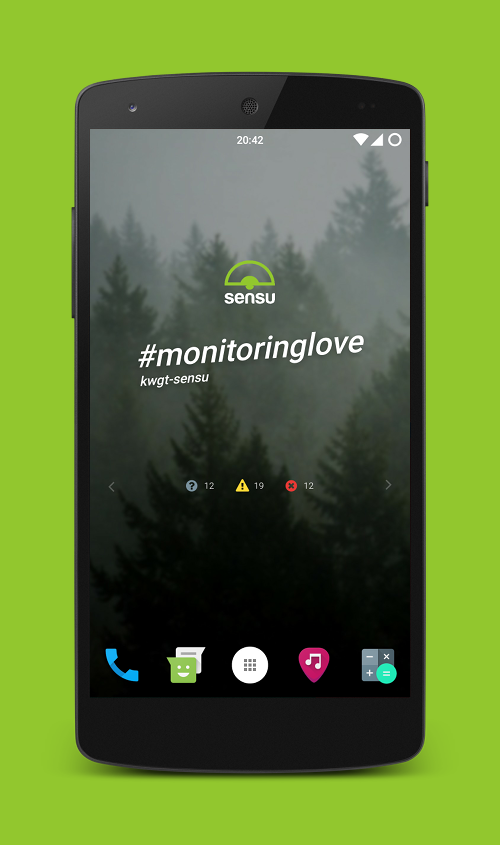

# kwgt-sensu
kwgt-sensu is a widget for your Android device that shows you the event counters. If no event exists, the number of clients is displayed.

## Preview

(The Nexus 5 device frame was created by Android and is licensed under [Creative Commons Attribution 2.5](https://creativecommons.org/licenses/by/2.5/))

## What is required?
You need [KWGT Kustom Widget Maker](https://play.google.com/store/apps/details?id=org.kustom.widget) and [KWGT Kustom Widget Pro Key](https://play.google.com/store/apps/details?id=org.kustom.widget.pro).

KWGT is a WYSIWYG Widget Maker for Android. You get it at Google Play.

## How to build?
A KWGT preset file is a zip file with an `.kwgt` extension. The `preset.json` file is the most important file. All settings are defined there.

Actually, there are two widgets in this repository. `kwgt-sensu-monitoringlove` and `kwgt-sensu-events`. The monitoringlove widget is not required to show the events. It displays the Sensu logo and a hashtag as widget. But it's also nice to have if you're a sensu fan.

Use the `build.sh` to generate the `.kwgt` files. Copy the files to your android device. Put them into the `Kustom/widgets/` path.

## How to use?
View the [screenshots folder](screenshots/) to find out what this widget might look like.

Open your KWGT widget. You will need to set your API there. We use global variables. That makes it very simple. Go to `Globals` and set your API with address and port.

You can tap the widget to reload the event data. Be patient. Sometimes it may take up to 10 seconds to load the events. You can set the default update interval in the KWGT menu.
